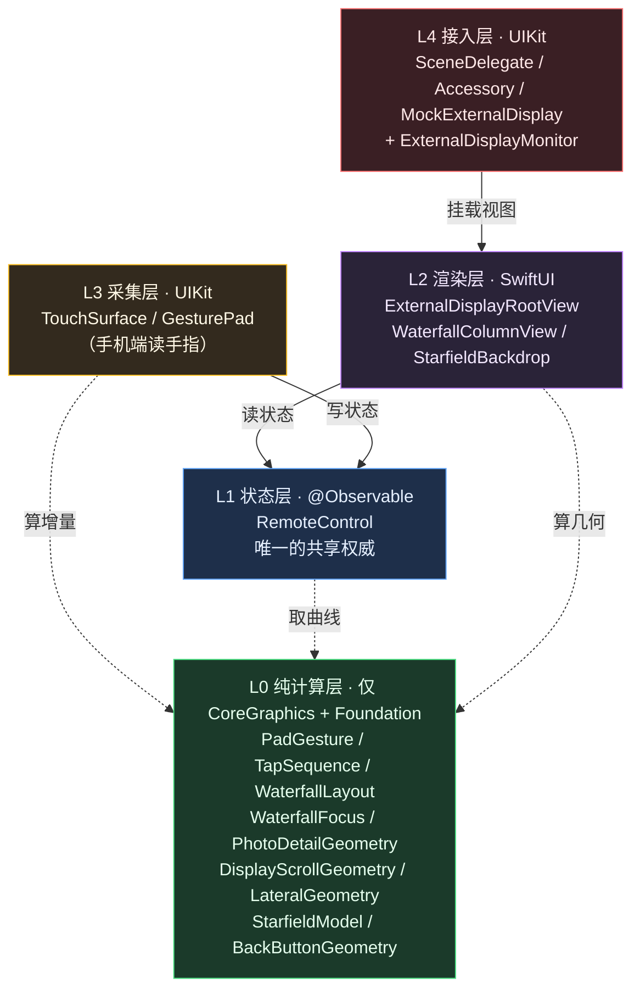
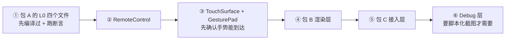

# 可移植清单：手势 / 滚动 / 瀑布流 / 星海

> 目的：把这套效果搬到别的项目时，**该带走哪些文件、哪些文档，以及必须替换掉什么**。
>
> 本文的分组**不是按目录猜的**，是扫出来的 —— 逐文件读 `import`，再逐个符号查跨文件引用。
> 结论里每一处"零依赖"都实测过。

本工程共 **31 个源文件 / 6103 行**，拆成：

| 组 | 文件数 | 行数 | 带走？ |
| --- | --- | --- | --- |
| 包 A · 手势 + 滚动 | 7 | 1472 | ✅ 原样 |
| 包 B · + 瀑布流 / 星海 / 幕墙 | +8 | +2232 | ✅ 原样（一处需动手） |
| 包 C · + 外接屏接入链路 | +6 | +698 | ✅ 原样（需改配置） |
| 可选 · 激光空鼠 | 5 | 1181 | 按需 |
| 本项目演示内容 | 5 | 520 | ❌ 不要带 |

另有**两个不在仓库里的东西必须单独拷**（`.scratch/` 已 gitignore）—— 见第十节，这是最容易漏的。

> ### ✅ 这套清单已经实跑验证过
>
> 按第十节的脚本抽出 24 个源文件（**5159 行**，与"包 A + B + C"之和精确吻合），
> 然后**在导出目录里独立编译那 9 个纯计算文件 + 断言 harness**：
>
> ```
> 断言 366 条，失败 0 条
> 全部通过
> ```
>
> 这条验证同时证明三件事：9 个纯文件确实零外部依赖、harness 可以脱离本工程运行、
> 「哪些文件是纯的」这份清单没有多也没有少。
> 现成的导出包留在 `.scratch/portable-effects/`（700 KB，gitignored）。

---

## 一、分层与依赖方向



**依赖是单向的：箭头永远从上往下。** 这一点是整个可移植性的基础 ——
L0 那 9 个文件**不知道上面三层的存在**，所以可以单独拿走、单独编译、单独跑断言。

---

## 二、包 A · 手势 + 滚动（8 文件 · 1671 行）

这是最通用的一包，**完全不涉及"外接屏"这个概念** —— 搬到任何 iOS app 里，
就是一整套"手指落下 → 归一化滚动量"的采集与状态层。

| 文件 | 行 | import | 作用 |
| --- | --- | --- | --- |
| `Sources/Core/PadGesture.swift` | 337 | CG + Foundation | **纯状态机**：触摸点数组 → `.pointer` / `.scroll` / `.lateral` / `.tap`。含 slop、主轴锁定、指数变化重设锚点 |
| `Sources/Core/TapSequence.swift` | 67 | Foundation | **跨会话的单/双击判定**。只吃 `Date`，因此住在手势层之外 —— 理由见下面那条注记 |
| `Sources/Core/RemoteControl.swift` | 420 | CG + Foundation + Observation | **唯一共享权威**：`position`（三段）+ `lateralRaw` + 光标 + 选中 + 缩放 + 当前在哪一页 |
| `Sources/ExternalDisplay/DisplayScrollGeometry.swift` | 211 | CG + Foundation | `ScrollMetrics`（滚动/下拉换算 + 四角圆角）+ `PullCurve`（阻尼手感） |
| `Sources/ExternalDisplay/LateralGeometry.swift` | 92 | CG + Foundation | `LateralMetrics` + `LateralCurve`（横向推开几何） |
| `Sources/App/TouchSurface.swift` | 135 | SwiftUI + **UIKit** | 透明 `UIView`，`isMultipleTouchEnabled = true`，上报**全部**触点 |
| `Sources/App/GesturePad.swift` | 253 | Foundation + SwiftUI | 采集面视图 + 提示文案 + `RemoteScrollIndicator` |
| `Sources/App/RemoteControlPad.swift` | 146 | Foundation + SwiftUI | 触控板那块的组装 + 绝对定位兜底控件 |

> **`TapSequence` 的两个位置关系，搬的时候要一起搬**：
> ① 状态必须是**独立的值类型**，不能塞进 `PadGesture` —— 双击天然跨会话
> （两次轻点分属两次「按下 → 抬起」，中间隔着一次完整的状态机复位），
> 而 `PadGesture` 每次会话结束都会 `reset()` 清空全部状态，时间戳会被一起清掉。
> ② 判定点必须落在 `RemoteControl.tap()` —— 「确认」有三条入口
> （触控板轻点 / 空鼠栏轻点 / 空鼠扳机），它们都汇聚到那里。
> 放在手势层的话，后两条路永远双击不起来。

**接进新项目只要三步**：

```swift
// 1. 把 RemoteControl.shared 换成你自己的状态容器（或直接用）
// 2. 在要接收手势的地方放一块采集面
GesturePad(
    hints: [GesturePadHint(text: "双指滑动 → 滚动")],
    height: 168,
    mapsPointer: true,
    scrollGesture: .twoFinger,        // 触控板语义；空鼠栏用 .oneFinger
    onTap: { /* 你自己的点击处理 */ }
)

// 3. 读状态驱动你的内容
.offset(y: ScrollMetrics(...).contentOffset(scroll: remote.scroll, pull: remote.pull))
```

> ⚠️ **别把它放进 `ScrollView` / `Form`。** 祖先滚动视图的 pan 识别器一旦认可，
> 会给采集视图发 `touchesCancelled` —— 比 SwiftUI 的手势竞争更难察觉。
> 用 `.safeAreaInset(edge: .bottom)` 挂在滚动区域**之外**。

**为什么双指必须用 UIKit**：SwiftUI 在 iOS 17 上拿不到"双指整体平移" ——
`DragGesture` 不报触点个数，`MagnifyGesture` 只给缩放比，`SpatialEventGesture` 要 iOS 18+。
详见 [`devnotes/2026-09-24-trackpad-two-finger.md`](devnotes/2026-09-24-trackpad-two-finger.md)。

---

## 三、包 B · 加瀑布流 + 星海 + 幕墙（再 10 文件 · 2755 行）

| 文件 | 行 | 作用 |
| --- | --- | --- |
| `WaterfallLayout.swift` | 509 | 贪心分列 + `WaterfallPlacement`（逐项 CGRect，以**列排布区**为基准）+ 演示数据 |
| `WaterfallFocus.swift` | 61 | 命中判定：视口点 → 卡片 id（半开区间） |
| `WaterfallColumnView.swift` | 282 | 列渲染 + 焦点环 / 光晕 |
| `WallMaterial.swift` | 42 | 半透材质常量（底板 0.58 / 卡片 0.84） |
| `StarfieldModel.swift` | 266 | 星表 + 透视投影（**纯计算**，含亮度幂律、闪烁相位、十字光芒） |
| `StarfieldBackdrop.swift` | 325 | 星海渲染（`TimelineView(.animation)` + `Canvas`） |
| `BackButtonGeometry.swift` | 61 | 浮动返回按钮的几何 + 命中（按**圆**判） |
| `PhotoDetailGeometry.swift` | 143 | 详情页几何：`整图`（`min`）/ `铺满`（`max`）、可平移量、夹取（**纯计算**，可独立断言） |
| `PhotoDetailView.swift` | 250 | 详情页渲染：只画不算几何；每帧把夹取结果回写给模型 |
| `ExternalDisplayRootView.swift` | 816 | 组装根视图：hero + 瀑布流 + 详情页 + HUD + 光标 + 涟漪 + 返回按钮 |

**这一包有一个必须动手拆的地方**：

> `WaterfallColumnView` 用了 `LaserPalette`（焦点环与光标的共用配色），
> 而 `LaserPalette` 定义在 `ExternalDisplayRootView.swift` 里 —— 那个文件 816 行，
> 同时装着 `WallShape`、`DisplayPlan`、HUD、光标、涟漪。
>
> **建议先把它拆成独立的 `LaserPalette.swift`（或 `FocusPalette.swift`）**，
> 否则"只想要瀑布流卡片"的人被迫拖走整个 777 行的组装根视图。
> 同理 `WallMaterial` 已经独立了，照着它做即可。

**星海这一包的六条关键认知**（都在 `StarfieldModel` 的推导里）：穹顶底色、
亮度幂律分布、每颗星独立的闪烁相位（**同步呼吸是"假"的第一来源**）、
最亮 3% 的十字光芒、尺寸与亮度正相关、深度衰减。

---

## 四、包 C · 加外接屏接入链路（再 6 文件 · 698 行）

| 文件 | 行 | 作用 | 搬到新项目要改 |
| --- | --- | --- | --- |
| `ExternalDisplaySceneDelegate.swift` | 62 | iOS 17–26 的 scene 落点 | `configurationName` 必须与 Info.plist 一致 |
| `ExternalDisplayAccessory.swift` | 71 | iOS 27+ 的 SwiftUI scene accessory | 挂载点要换成你的根视图 |
| `Core/ExternalDisplayMonitor.swift` | 127 | 连接状态中心 | 无 |
| `Debug/MockExternalDisplay.swift` | 205 | 模拟器替身窗口 | `scale = 3` 是**硬编码伪造**；窗口文案 |
| `Debug/MockRemoteState.swift` | 158 | 启动参数预置状态 | 字段名与本项目状态绑定 |
| `Debug/MockDockState.swift` | 75 | 启动参数预置遥控台 | 记号与本项目 UI 绑定 |

**Info.plist 三处必须同时对上**（少一处都是"插上屏只镜像、不扩展"）：

```xml
<key>UIApplicationSupportsMultipleScenes</key><true/>
<!-- scene manifest 里声明的 role -->
UIWindowSceneSessionRoleExternalDisplayNonInteractive
<!-- 且 configurationName 与 ExternalDisplaySceneDelegate.configurationName 一字不差 -->
```

---

## 五、可选模块 · 激光空鼠（5 文件 · 1181 行）

| 文件 | 行 | 作用 |
| --- | --- | --- |
| `Core/AirMouse.swift` | 357 | CoreMotion 陀螺仪 → 激光指针 + 拖尾 |
| `Core/MotionWarmup.swift` | 380 | 传感器预热/校准的诊断与记录 |
| `Debug/MockAirMouseSource.swift` | 54 | 无陀螺仪时的替身 |
| `App/AirMousePad.swift` | 208 | 空鼠栏（单指滚动 + 轻点确认） |
| `App/AirMouseDiagnostics.swift` | 182 | 诊断面板 |

这一包**与包 A/B 正交** —— 它只做两件事：写 `RemoteControl.pointer`
（`movePointer(to:source: .airMouse)`，用 `pointerSource` 记录光标归属）、
调 `RemoteControl.tap()`。不要激光指针就整个丢掉，不影响前三个包。

---

## 六、❌ 不要带（5 文件 · 520 行）

这些是**本项目的演示内容**，不是可复用能力：

| 文件 | 行 | 为什么不要带 |
| --- | --- | --- |
| `Core/DisplayContentStore.swift` | 41 | 演示用的图案选择器（渐变/网格/彩条）+ 标题文案 |
| `ExternalDisplay/DisplayPatternCanvas.swift` | 107 | 铺底的装饰图案 canvas |
| `App/PhoneRootView.swift` | 120 | 本项目的手机端表单 + mock 开关 |
| `App/RemoteControlDock.swift` | 182 | 本项目的遥控台外壳（**且它硬引用了 Debug 层**） |
| `App/ExternalDisplayDemoApp.swift` | 70 | 应用入口与启动参数解析 |

> ✅ **一个好消息**：包 A/B/C 的 15 个文件对 Debug 层**零代码依赖** ——
> 逐个 grep 过，`MockRemoteState` / `MockDockState` / `MockExternalDisplay` 只在**注释**里出现。
> 所以带走它们**不会拖进任何调试代码**。
>
> Debug 层真正的代码级渗透只在上面这 3 个"不要带"的文件里
> （`PhoneRootView` 的 mock 开关、`RemoteControlDock:77` 的 `reserveBottom`、
> `ExternalDisplayDemoApp` 的 bootstrap）。

---

## 七、必须替换的 5 处（实测出来的耦合点）

| # | 位置 | 现状 | 换成什么 |
| --- | --- | --- | --- |
| 1 | `ExternalDisplayRootView.swift:83` | `items = WaterfallItem.demoItems(count:)` | 你的真实数据源（只要满足 `Identifiable` + 权重高度） |
| 2 | `LateralGeometry` 的 `rawLimit` | 与纵向同**物理行程** 151pt（1080p 基准） | 按你屏宽重算 —— 归一化 1:1 映射下"手指移多少"与"内容移多少"不能同时成立 |
| 3 | `MockExternalDisplay.scale` | 硬编码 `3` | 你目标屏的 scale；它只影响**上报的分辨率**，不影响布局 |
| 4 | `MockRemoteState` 的字段 | 与本项目状态一一对应 | 你的状态字段；语义要保住「伪造的是**输入**，不是度量」 |
| 5 | `WaterfallMetrics.wallColumns` | 显式 6 列（幕墙要缝密） | 你的列数；退回首自适应就用 `columnCount(for:)` |

另有两处**概念替换**（不用改代码，但要知道）：

- **"外接屏"这个前提。** `ScrollMetrics` 存在的理由就是"手机端送归一化值、渲染侧按自身尺寸换算"。
  如果新项目里渲染侧和输入侧在同一块屏（普通 app 内滚动），这一层还可以保留 ——
  它仍然帮你解决"内容高度是布局算完之后才知道"这件事（瀑布流必须这样）。
- **`@MainActor @Observable` 单例。** `RemoteControl.shared` 之所以够用，是因为手机屏与外接屏
  **跑在同一个进程**里，只是分属不同 `UIScene`。跨进程就要换通道。

---

## 八、文档：哪篇讲什么，怎么带

| 文档 | 行 | 讲什么 | 怎么带 |
| --- | --- | --- | --- |
| `docs/scroll-feel.md` | 264 | **为什么跟手**（体感角度）：没有 `UIScrollView`、位移逐帧无插值、slop 被吃掉、增量而非累计、归一化进度、单一权威标量、纯变换不触发布局；并明确写了**没有惯性**及其取舍 | ✅ 原样 |
| `docs/devnotes/2026-09-24-airmouse-gesture.md` | 356 | 手势为何必须抽成纯状态机 + 四个易错点 | ✅ 原样 |
| `docs/devnotes/2026-09-24-trackpad-two-finger.md` | 169 | 为什么双指必须落 UIKit；**指数变化为什么必须重设锚点** | ✅ 原样 |
| `docs/devnotes/2026-09-24-waterfall-starfield.md` | 509 | 为什么 `LazyVGrid` 不行；scroll/pull 双维度模型；星海假 3D 的六条质感来源 | ✅ 原样（星海的核心推导在这） |
| `docs/devnotes/2026-09-24-waterfall-inset-focus.md` | 244 | 命中层该在哪一侧算；`placements` 为何要与留白解耦 | ✅ 原样 |
| `docs/devnotes/2026-09-24-glass-wall-material-back.md` | 233 | 半透材质取舍、曝光量、按钮命中优先级、**像素探针误判的完整记录** | ✅ 原样 |
| `docs/external-display-screenshot.md` | 321 | 截图四段链路 + 探针容差陷阱 + 能截/不能截 | ⚠️ 改项目名与 UDID |
| `docs/mock-external-display.md` | 446 | 替身窗口原理（本来就是按"可发布"写的） | ⚠️ 改 bundle id / 类名 |
| `docs/devnotes/2026-09-22-swiftui-scene-accessory.md` | 82 | iOS 27 scene accessory 改造 | ⚠️ 只在带包 C 时 |
| `docs/specs/glass-wall-gesture.md` | 461 | 需求拆解 → 决策清单 → 分期的**方法** | ⚠️ **当模板用**：结构与提问方式可复用，需求内容是本项目的 |
| `README.md` | 990 | 全部工程约定 + 20+ 踩坑 | ❌ 不整份带。摘第九节（交互）与最后那串踩坑清单 |

---

## 九、这里真正值得抄的东西（实践思路）

代码可以重写，下面六条是这套实现里**最难自己重新摸出来**的部分。

### 1. 把"会不会算错"与"会不会接到"分开

7 个纯计算文件**只依赖 `CoreGraphics` + `Foundation`**，零 SwiftUI、零 UIKit、
零对上层任何符号的代码级引用（实测：非零匹配全部落在注释里）。
于是它们可以用 `swiftc` 独立编译、喂事件断言 —— 不需要 Xcode、不需要模拟器。

**这不是巧合，是硬约束。** 手感、布局、投影恰好是最容易算错的部分，
把它们放进可断言的层，等于给最容易漏水的地方装了水位计。

### 2. 几何权威在渲染侧，输入侧只送归一化值

手机端送给共享状态的永远是**归一化进度**（`scroll: 0…1`、`lateral: −1…1`），
不是像素位移。渲染侧按自己的尺寸换算。

**这是"同一份状态能落在任何屏上"的根本原因** —— 1080p / 4K / 模拟器替身窗口
尺寸差几十倍，代码一行不用改。反过来说，凡是"手机端算好像素再传过去"的写法，
换块屏就必须重算，而且错得不明显。

### 3. 一个数轴能推出来就合并，推不出来才并列

- `scroll` 与 `pull` 看起来是两个维度，实际是**同一条数轴上的两段**（越过顶部后语义变了）
  → 合并成一个 `position`。拆成两个可独立写的存储属性的话，下拉时被阻尼吃掉的那部分行程，
  在回拉时会变成凭空多出来的滚动，**手指一松内容就跳**。
- 横向与纵向**物理正交**（手指横向位移与纵向位移是两件独立的事）→ 并列成第二条轴。

判据只有一句：**能不能靠一个数轴上的位置关系互相推导。**
这条判据写进了 `RemoteControl` 的文档注释里，`bottomPull`（>1 段）后来也是照着它加进去的。

### 4. 不给假安全感：每条结论都标明"验证了没"

做不到的验证**显式写进文档**，不用"应该没问题"糊过去。已知的三处：

| 做不到的 | 为什么 | 文档里怎么写的 |
| --- | --- | --- |
| 触摸到底有没有被 UIKit 收到 | 没有触摸注入 API；本机 Xcode 精简安装，模拟器 GUI 起不来 | README「验证边界」段落，直接写"**这层在本机没有自动验证手段**" |
| 真机 + 真外接屏的画面 | 渲染在另一块 `UIScreen` 上，截图命令只抓手机屏 | `external-display-screenshot.md` 第八节 |
| 真机上的实际帧率 | 替身窗口与手机 UI 共用同一渲染面 | `mock-external-display.md` §六 |

### 5. 先看到红，再改

三条已经变成习惯的做法：

- **bug 先写复现测试**，看到它失败，再动手。复现不出来就停下报告，不硬改。
- **改完截图"看起来没变化"时，先排除"构建没生效"** —— 比对模拟器容器内二进制与构建产物的
  md5，比看截图猜可靠得多。
- **测量工具本身也会骗人**：那句"墙根本没动"是归并阈值（6）把 `#020205` 与 `#000001`
  差 1~2 个单位的边界一起吞掉了。**找边界的自动化必须能分辨 1 个单位**，
  阈值松的扫描会给出一个自信的错误答案。

### 6. 凡是"被别人当常数依赖"的值，一律实测上报

遥控台的高度曾经写死 96 —— 空鼠栏加了一块手势面之后，「触控板 / 空鼠」切换器就被替身窗口盖住了。
现在由 `RemoteControlDock` 自己上报（`reserveBottom(_:)`），窗口据此避让。

同理，`WaterfallMetrics.wallColumns` 成为列数的**单一来源** ——
之前视图硬编码 6 列、而验收脚本用自适应的 3/4 列算几何，
**脚本断言的是另一套列宽**。这种"两份常数"不会报错，只会让你在错误的前提下得出全绿。

---

## 十、搬运顺序，以及两个最容易漏的东西

### 建议顺序（依赖拓扑序）



**第 ① 步必须先跑断言再往下走。** 手感层的错误在 UI 上表现为"有点怪"，
在没有护栏的情况下极难定位 —— 而断言能在 1 秒内告诉你曲线是不是单调、边界归谁。

### ⚠️ 两个不在仓库里、但必须带走的东西

`.scratch/` 已被 gitignore。下面两样是这套实现里**最值钱**的部分，很容易被漏掉：

| 遗漏项 | 路径 | 为什么必须带 |
| --- | --- | --- |
| **断言harness** | `.scratch/verify/main.swift` | **366 条断言**，覆盖布局几何、命中边界、手势状态机、曲线单调性、按钮优先级、详情页几何与双击判定。没有它，搬过去的是一堆没有护栏的代码 |
| **包围盒工具** | `.scratch/tools/bbox/main.swift` | 求替身窗口橙色边框的包围盒（截图核对的第一步）。见 `docs/photo-detail.md` 第六节 |
| **像素工具** | `.scratch/tools/crop.swift`、`.scratch/tools/probe.swift` | 截图裁切 + 逐像素判读。重建命令写在 `docs/external-display-screenshot.md` 第六节 |

断言 harness 的编译方式（不依赖 Xcode）：

```bash
swiftc -O Sources/ExternalDisplay/WaterfallLayout.swift \
         Sources/ExternalDisplay/WaterfallFocus.swift \
         Sources/ExternalDisplay/PhotoDetailGeometry.swift \
         Sources/ExternalDisplay/DisplayScrollGeometry.swift \
         Sources/ExternalDisplay/LateralGeometry.swift \
         Sources/ExternalDisplay/BackButtonGeometry.swift \
         Sources/ExternalDisplay/StarfieldModel.swift \
         Sources/Core/PadGesture.swift \
         Sources/Core/TapSequence.swift \
         .scratch/verify/main.swift -o .scratch/verify/verify && .scratch/verify/verify
```

> 注意这份 `swiftc` 命令行**本身就是"哪些文件是纯的"的清单** ——
> 能被它编译进去的，就是零依赖的那一批。搬完之后再编译一次，就知道有没有把
> 上层依赖偷偷带进来。

### 抽取脚本（把包 A/B/C 拷成一个独立目录）

```bash
cd /Users/jove/Developments/ExternaldisplayDemo

DEST=~/Desktop/portable-effects
mkdir -p "$DEST/Sources" "$DEST/docs" "$DEST/harness"

# 包 A + B + C 的 24 个文件
for f in \
  Core/PadGesture.swift Core/TapSequence.swift Core/RemoteControl.swift \
  ExternalDisplay/DisplayScrollGeometry.swift ExternalDisplay/LateralGeometry.swift \
  App/TouchSurface.swift App/GesturePad.swift App/RemoteControlPad.swift \
  ExternalDisplay/WaterfallLayout.swift ExternalDisplay/WaterfallFocus.swift \
  ExternalDisplay/WaterfallColumnView.swift ExternalDisplay/WallMaterial.swift \
  ExternalDisplay/PhotoDetailGeometry.swift ExternalDisplay/PhotoDetailView.swift \
  ExternalDisplay/StarfieldModel.swift ExternalDisplay/StarfieldBackdrop.swift \
  ExternalDisplay/BackButtonGeometry.swift ExternalDisplay/ExternalDisplayRootView.swift \
  ExternalDisplay/ExternalDisplaySceneDelegate.swift ExternalDisplay/ExternalDisplayAccessory.swift \
  Core/ExternalDisplayMonitor.swift \
  Debug/MockExternalDisplay.swift Debug/MockRemoteState.swift Debug/MockDockState.swift \
; do
  mkdir -p "$DEST/Sources/$(dirname "$f")"
  cp "Sources/$f" "$DEST/Sources/$f"
done

# 文档
cp docs/scroll-feel.md docs/external-display-screenshot.md docs/mock-external-display.md "$DEST/docs/"
cp docs/photo-detail.md "$DEST/docs/"
cp -R docs/devnotes "$DEST/docs/devnotes"

# ⚠️ 最值钱的两样（在 gitignore 里）
cp .scratch/verify/main.swift "$DEST/harness/"
cp .scratch/tools/crop.swift .scratch/tools/probe.swift "$DEST/harness/"
mkdir -p "$DEST/harness/bbox"
cp .scratch/tools/bbox/main.swift "$DEST/harness/bbox/main.swift"

echo "已导出到 $DEST"
```

> 这份脚本实跑过一遍（`DEST=.scratch/portable-effects`），产出 24 个源文件 / 5159 行，
> 并在导出目录内编译断言全绿。改 `DEST` 即可直接用。

### 新项目若也用 XcodeGen

**新增源文件后必须先 `xcodegen generate`**，否则文件不进编译集，
而 `xcodebuild` 依然报 `BUILD SUCCEEDED` —— 是**静默跳过的假阳性**。
判据：查 `Build/Intermediates.noindex/**/Objects-normal/*.o` 是否包含该文件。

---

## 相关文档

- [`scroll-feel.md`](scroll-feel.md) —— 滚动为什么跟手（**先读这篇**，它解释了设计意图）
- [`mock-external-display.md`](mock-external-display.md) —— 没有硬件时怎么调试外接屏 UI
- [`external-display-screenshot.md`](external-display-screenshot.md) —— 怎么把效果拍下来核对
- [`specs/glass-wall-gesture.md`](specs/glass-wall-gesture.md) —— 需求 → 决策 → 分期的方法模板
