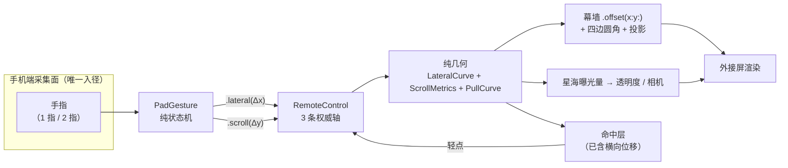

# 玻璃幕墙手势 —— 需求理解与方案（待审核）

> 分支 `feat/glass-wall-gesture`（基于 `192d07b`）。
> 本文是这一件事的**唯一规格**。实施完成后，结论进 `README.md` 与 `docs/devnotes/`，
> 本文只做增补、不再另起一份。
>
> 状态：**已拍板；阶段 1–3 已实施，阶段 4 部分实施** —— 见文末 §10。

---

## 0. 待拍板清单（先看这个）

| # | 决策点 | 我的推荐 | 影响面 |
|---|---|---|---|
| **D1** | "150pt" 的参照系 —— 横向位移上限怎么定 | `base × 0.28`（≈1080p 上的 150pt，屏宽 16%） | 观感，不改结构 |
| **D2** | 横向与纵向同时出现时：主轴锁定 vs 自由二维 | **主轴锁定**（首次越过 slop 的那一轴独占本次会话） | 手感，改 `PadGesture` |
| **D3** | 松手后：粘滞 / 回弹 / 吸附档位 | **粘滞**（与今天的滚动、下拉一致；本项目目前根本没有回弹） | 手感；回弹是另一单 |
| **D4** | 玻璃到什么程度 | **不模糊**：去掉容器不透明底 + 卡片半透（假玻璃） | 帧预算，见 §6 |
| **D5** | 返回按钮点了之后发生什么 + 视觉规格 | 语义待你定义（见 §4.5）；视觉给了一版规格待确认 | 结构，需新增反向写入 |
| **D5′** | *(后续落地)* 返回按钮的语义 | **已定**：详情页里 = 退出详情回幕墙（`RemoteControl.closeDetail()`）；幕墙页 = 仍只记一条事件 | 见 §4.5 末尾的补充 |
| **D6** | 星海在"静止但有透光"时是否继续跑帧 | **静止冻结**（暂停重绘，画面保留），交互时才动 | 帧预算 |
| **D7** | 列数要不要提到 6 | **先不提**（模拟器上列宽会掉到 52pt） | 观感，见 §1-R1 |
| **D8** | 底部上拉行程是否与顶部对称（各 0.5 视口高） | **对称**，复用同一条 `PullCurve` | 几何 |
| **D9** | 过卷时另外三条边要不要也起圆角 | **要**（统一按"浮板"处理） | 观感 |

D1 / D2 / D4 / D5 是**阻断性**的，其余我按推荐走即可。

---

## 1. 需求拆解（我的理解）

先把你的原话拆成 6 条可验收项，逐条对着代码核。

### R1 · 瀑布流是一块玻璃幕墙

**我的理解**：整片瀑布流不再是"铺满屏幕的内容"，而是**一块浮在星海之上的板**。
板本身半透光，板与屏幕边缘之间有缝，缝里是星海。

**现状**：瀑布流是内容列（`WaterfallColumnView`），外层的 `contentColumn` 有一个
**刻意做成不透明**的底：

```swift
// ExternalDisplayRootView.swift:243-245
// 容器背景必须不透明：下拉让出的上半屏要露出星海，若容器透光，
// 星海会从卡片缝隙里透上来，背景墙的"墙"就立不住了。
.background(Color(red: 0.004, green: 0.005, blue: 0.014))
```

**缺口**：这条注释就是 R1/R6 要反转的那条决策。见 §5-冲突 1。

**顺带一问（D7）**：你说"比如项目 6 列"，但当前规则是
`w/h > 1.6 ? 4 : 3`（`WaterfallLayout.swift:133-136`），模拟器替身窗口（362×204）
走的是 **4 列**。若真要 6 列：

| 面 | 列宽 @4 列 | 列宽 @6 列 | 6 列的后果 |
|---|---|---|---|
| 模拟器 362×204 pt | 80.0pt | **51.8pt** | 底栏文案（字号 base×0.038 ≈ 7.8pt）放不下 |
| 1080p 960×540 pt | 212.2pt | 137.5pt | 可以接受 |

所以 6 列在真外接屏上没问题，在模拟器上会把卡片压窄到看不清。**要不要为它改 `columnCount`？**

### R2 · 左上角一个返回按钮

**我的理解**：外接屏左上角一个可被激光指针命中的按钮。

**现状**：源码里**完全不存在**任何"返回"相关的东西（全量 grep 为空）。
外接屏是纯输出视图，一个手势都没有（`ExternalDisplayRootView.swift:14-22`），
所以按钮只能靠"指针落点命中 + 轻点"来驱动 —— 和卡片选中是同一条路。

**缺口**：需要
1. 一个纯几何的按钮矩形（按 `base` 缩放，不能写死点数）；
2. 命中层从"只认卡片"泛化成"有序的可交互区域"（按钮优先于卡片）；
3. 一条**反向写入**（外接屏 → 模型），语义待定，见 §4.5。

### R3 · 横向推开（左 / 右各露星海）

**我的理解**：手势在采集面上横向滑动 → 整片内容横向平移 → 让出的那一侧露出星海。
左滑露右侧、右滑露左侧。

**现状**：横向被**刻意丢弃**：

```swift
// PadGesture.swift:195-199
// 横向分量**刻意忽略但不拦截**：斜着拖照样能滚，只是横向那段不产生位移。
```

**缺口**：横向要变成一条真正的轴 —— 新的归一化状态 + 新的位移上限 + 新的阻尼曲线。

**这里有个必须澄清的量纲问题（D1）**：「150pt」只能钉在一侧。

你说的是"手势滑动 150pt"还是"墙移动 150pt"？这两件事在归一化映射下**不能同时成立**：
采集面在手机上（宽约 370pt），外接屏可能是 960pt（1080p）。本项目纵向走的是
**归一化 1:1**（`delta.height / padSize.height`，见 `PadGesture.swift:198`），
横向要与它同构，所以只能钉"墙移动多少"。

| 参照 | `base` 比例 | 模拟器 362×204 | 1080p 960×540 |
|---|---|---|---|
| 「模拟器窗口上的 150pt」 | 0.735 | 150pt（屏宽 **41%**） | 397pt（41%） |
| 「1080p 上的 150pt」 | **0.278** | 57pt（屏宽 **16%**） | 150pt（16%） |
| 更克制一档 | 0.14 | 29pt（屏宽 8%） | 76pt（8%） |

我推荐 **0.278**：41% 那一档会把幕墙推掉近一半，"幕墙"就不成立了。

### R4 · 顶部下拉露星海

**现状**：**已经有了**，而且是这套几何里推导得最完整的一条
（`ScrollMetrics.pullDistanceRatio = 0.5`，`pull = 1` 时内容顶边恰好落在屏幕中线；
`maxLeadingElementHeight` 由它反推出 hero 的高度上限）。

**缺口**：无。但见 §5-冲突 2 —— 容器一旦透光，"露出星海"这件事的含义变了。

### R5 · 底部上拉露星海

**我的理解**：滚到底之后再继续上拉，内容的**下沿**离开屏幕下沿，下方露出星海。

**现状**：`RemoteControl.position` 被钳在 `[-0.9, 1]`，`scroll(to:)` 也钳在 `[0, 1]`
（`RemoteControl.swift:117`、`:131`）—— 底部没有任何超出行程。

**缺口**：纵向从"两段"变"三段"。好消息是几何上**不需要动结构**：
滚到底时内容下沿正好压在屏幕下沿（这是 `maxOffset` 的定义，
`DisplayScrollGeometry.swift:34`），所以再上移多少，下面就露出多少。
容器只需要在那一刻起**下边圆角 + 投影**。

### R6 · 透过 column 间隔看到星海

**我的理解**：列与列之间那条缝（`columnSpacing = base × 0.022`，模拟器上 4.5pt）
透出星海。

**现状**：缝是存在的（`HStack(spacing: metrics.columnSpacing)`），但它背后是
`contentColumn` 的不透明底 —— 所以今天看到的是底色，不是星海。

**缺口**：同 R1，去掉不透明底即可。**但这条会把星海从"交互时才可见"变成"常驻可见"**，
见 §6。

---

## 2. 现状盘点

| 环节 | 文件 | 关键事实 |
|---|---|---|
| 触摸采集 | `Sources/App/TouchSurface.swift` | UIKit `touchesBegan/Moved/Ended`，已能拿到**全部**手指 |
| 手势判定 | `Sources/Core/PadGesture.swift` | 纯状态机；`ScrollGesture.oneFinger/.twoFinger`；横向丢弃 |
| 手机端接线 | `RemoteControlPad.swift` / `AirMousePad.swift` | 触控板 `.twoFinger`，空鼠栏 `.oneFinger` |
| 共享状态 | `Sources/Core/RemoteControl.swift` | **唯一权威**标量 `position`；`zoom` / `pointer` / `selectedItemID` |
| 纵向几何 | `Sources/ExternalDisplay/DisplayScrollGeometry.swift` | `ScrollMetrics` + `PullCurve`，全是纯函数 |
| 横向几何 | `WaterfallLayout.swift:102-118` | `horizontalInset` / `columnSpacing` / `columnWidth` |
| 命中 | `Sources/ExternalDisplay/WaterfallFocus.swift` | `fieldOrigin` + 每帧的 `contentOffsetY` |
| 星海 | `Sources/ExternalDisplay/StarfieldBackdrop.swift` | `Canvas` + `TimelineView`；`paused: pull <= 0.002` |
| 容器 | `ExternalDisplayRootView.swift:225-253` | 不透明底、`TopRoundedRect`、`.offset(y:)` |
| 调试预置 | `Sources/Debug/MockRemoteState.swift` | `-remoteState pull=…,scroll=…,pointer=…,selected=…` |

---

## 3. 核心模型：一块可以被四向推开的板

这是本次调研**唯一**需要建立的抽象。把上面 6 条需求合起来看，它们其实是同一件事：

> 幕墙 = 一块**尺寸固定、位置可变**的板。
> 板后面是星海。板被推向任意方向，让出的那一侧就露出星海。
> 板自身半透光，所以隔着板也看得到星海。



**为什么这个模型值得立**：
- R3 / R5 只是 `.offset` 的两个分量，不是两套机制；
- R4 已经是它的一部分（今天只是没被这么命名）；
- R1 / R6 是"板的材质"，与几何正交；
- 四边圆角 / 投影可以按"哪一侧被推开了"统一决定（D9）。

按这个模型，今天的 `contentColumn` 只差三样东西：**横向分量、底部超出行程、可透光的材质**。

---

## 4. 方案

### 4.1 手势层（`PadGesture`）

输入已经是触摸点数组，改动集中在"输出什么"：

| 新增 / 改动 | 说明 |
|---|---|
| `Action.lateral(CGFloat)` | 横向增量，已除以**采集面宽度**（与纵向除以高度同构） |
| `Action` 语义表 | 见下 |
| 主轴锁定（D2） | 首次越过 slop 那一帧记下"本会话的轴"，另一轴整段不出动作 |

**手指语义表**（空鼠栏 / 触控板各自的轴分配）：

| 场景 | 触控板 `.twoFinger` | 空鼠栏 `.oneFinger` |
|---|---|---|
| 1 指移动 | 只移光标 | — |
| 1 指上下 | 不动 | 滚动 / 顶部下拉 / 底部上拉 |
| 1 指左右 | 不动 | **横向推开** |
| 2 指上下 | 滚动 / 顶部下拉 / 底部上拉 | 按 1 指处理 |
| 2 指左右 | **横向推开** | 按 1 指处理 |
| 指数变化 | 重设基准，当帧零位移（已有） | 同 |

主轴锁定为什么推荐：今天"斜着拖照样能滚、横向那段丢弃"（`PadGesture.swift:195-199`）
等价于**隐式锁了纵轴**。显式锁定之后，那条手感被完整保留，只是横轴从"丢弃"变成"改变量"。
改成自由二维的话，一次略斜的竖拖会让幕墙横着飘 —— 那是新的、没被要求的行为。

### 4.2 状态层（`RemoteControl`）

**纵向：仍是"一个标量、多段"**，只是从两段变三段。这个设计在
`RemoteControl.swift:23-38` 有完整论证（避免"阻尼吃掉的那段在回拉时变成凭空多出的滚动"），
三段同样受益：

```
position < 0           → 顶部下拉（已有）
0 ... 1                → 滚动进度（已有）
position > 1           → 底部上拉（新增）
```

对外多暴露一个 `bottomPull: CGFloat`，与 `pull` 对称。

**横向：另一条独立轴**。它和纵向在物理上正交（两个方向的手指位移），
不能塞进 `position` —— 那是"同一条数轴上的两段"，横向没有这层关系。

```
lateral ∈ [-1, 1]      → 0 = 居中；> 0 = 幕墙右移（露左侧星海）
```

命名用 `lateral` 而不是 `x`：本项目里 `x` 已经被光标坐标占了。

### 4.3 几何层（新增纯函数，全部可断言）

| 新增 | 职责 | 与已有代码的关系 |
|---|---|---|
| `LateralCurve` | 横向原始行程 → `lateral ∈ [-1,1]` | 与 `PullCurve` 同族：`1 - (1-t)^1.7`，`t=1` 处**恰好**取 1 |
| `LateralMetrics`（或并入 `ScrollMetrics`） | `maxTravel = base × 0.278`；`offset(for:)` | 与 `ScrollMetrics` 并列 |
| `ScrollMetrics.bottomOffset(for:)` | 底部上拉位移，最大值 `视口高 × 0.5` | 复用 `pullDistanceRatio` |
| `WallShape` | 四边独立圆角 | 取代 `TopRoundedRect`（`ExternalDisplayRootView.swift:600`） |
| `BackButtonGeometry` | 按钮矩形 + 命中 | 与 `WaterfallFocus` 并列 |

四边独立圆角用 `RectangleCornerRadii` 直接表达，`TopRoundedRect` 已经是这个写法
（底角写死 0），把它参数化即可。

### 4.4 渲染层：玻璃怎么做

三条路，**成本差一个数量级**：

| 方案 | 做法 | 帧成本 | 星海观感 |
|---|---|---|---|
| **A** 只透列间 | 去掉 `contentColumn` 的不透明底 | **0** | 缝里看到清晰星点 |
| **B** A + 卡片半透（推荐） | 卡片填充加 alpha ≈ 0.82，底衬一层深色 | **0**（纯 alpha 混合） | 卡后隐约有星，像磨砂 |
| **C** B + 真模糊 | 卡片挂 `.ultraThinMaterial` | 每帧每卡一次 backdrop 采样 + 模糊（36 张 × 60Hz） | **星星被糊成雾** |

**我推荐 B，并且明确不建议 C。** 两个理由：

1. **成本**：36 张卡同时挂 backdrop blur，底下的星海还在动 —— 每帧 36 次离屏采样，
   4K 上是必然掉帧。项目里连"给 36 张卡全挂透明度 0 的阴影"都被否掉过
   （`WaterfallColumnView.swift:96-98`），理由是同一条。
2. **目标本身就不需要模糊**：你要的是"能看到后面的星星海"。模糊会把星点糊掉，
   剩下的是雾。**C 与需求方向相反。**

方案 B 的"玻璃感"靠三样现成的东西撑：卡片已有的白描边
（`WaterfallColumnView.swift:88-94`）、同侧径向高光（`:152-159`）、
以及焦点环那套白环语言（`:115-126`）。需要新增的只是"半透 + 一层深色底衬"。

### 4.5 返回按钮（`D5` 需要你定义）

**几何**（待确认，按项目惯例用 `base` 缩放）：

| 项 | 建议值 | 模拟器 362×204 上的实际值 |
|---|---|---|
| 尺寸 | `base × 0.11` 圆形 | 22.4pt |
| 左上边距 | `base × 0.045` | 9.2pt |
| 图标 | `chevron.left`（SF Symbol） | — |
| 悬浮态 | 白环（复用 `LaserPalette` 语言） | — |
| 命中优先级 | **高于卡片** | — |
| 层 | HUD 层（固定，不随幕墙移动） | — |

**语义**（必须你拍板，外接屏没有导航栈，所以"返回"到底返到哪只有你知道）：

| 选项 | 含义 | 实现 |
|---|---|---|
| **a** 复位幕墙 | 收起三向过卷 + 回到顶部 | 纯外接屏内部，`RemoteControl` 加 `wallReset()` |
| **b** 通知手机端 | 反向写入，手机端响应（收起 mock / 退出演示 / pop 导航） | 照 `selectedItemID` 的先例，加一条反向写入 |
| **c** 取消选中 | 把当前高亮的那张卡取消选中 | 最小改动，但语义上不叫"返回" |

我倾向 **a**（这一单内自洽，不牵动手机端），若你心里想的是 **b**，请说明手机端要响应什么。

> **补充（后续落地）**：这一单里三者都没选 —— 外接屏当时**没有第二页**，
> 所以按钮只记一条事件（`RemoteControl.noteBackButton()`），把"返到哪"留给之后。
> 照片详情页（[`docs/photo-detail.md`](../photo-detail.md)）进来之后，
> "返回"第一次有了真实的去处，于是接上：**详情页里 = 退出详情回幕墙**，
> 幕墙页上仍然是记一条事件。落到 `RemoteControl.closeDetail()`，
> 它刻意**不动** `position` / `lateralRaw` —— 幕墙的滚动位置是用户进来之前自己滚到的，
> 返回时原样呈现才对。上面的选项 b（通知手机端）依然没做，因为还没有需要。

### 4.6 焦点命中必须**同时**改（容易漏）

`WaterfallFocus.item(at:contentOffsetY:)` 现在只减了一个纵向偏移
（`WaterfallFocus.swift:45-49`）。幕墙横向位移之后，**如果不把横向位移喂进去，
指针点到的会是隔壁那张卡** —— 而且这个 bug 在纵向滚动之前不明显、横向一动就必然出现。

改法：把 `contentOffsetY: CGFloat` 换成 `contentOffset: CGSize`
（`ScrollMetrics` 统一产出 `x` 与 `y`）。两个量来源相同、更新频率相同，
合成一个值比加第二个参数更不容易漏。

**断言要点**：平移 `+T` 之后，原落点命中项必须变成"右边 T 处的那张"，且边界半开规则不变。

### 4.7 星海的运行条件

`StarfieldBackdrop` 现在用 `paused: pull <= 0.002` 控制跑帧
（`StarfieldBackdrop.swift:29`、`:36`）—— 依据是"没露出来就不用画"。
幕墙透光之后这条判据失效：**星海永远可见**。

推荐（D6）：判据从"露出来没"改成"**动没动**"。

```
有位移（任一轴非零）→ 跑帧（60Hz）
无位移但透光         → 暂停，保留最后一帧
```

`TimelineView` 暂停时保留最后一帧的画面，所以"静止时透过缝看到星海"依然成立，
而帧成本回到 0。代价是**静止时星星不闪**。

替代方案是常驻跑帧 —— 600 颗星、约 60 条合并 Path、30~75 颗亮星各带一层径向渐变，
在 4K 上永久占用。这笔账不建议付。

另一个连带项：`fadeIn` 现在由 `pull / 0.3` 驱动（`:56-59`），要让位给"曝光量"
（三向过卷的任一非零）。`camera.dolly` 同理。

---

## 5. 与既有拍板的三条冲突（需要你明确反转）

| # | 既有决策 | 出处 | 本条需求 | 处置 |
|---|---|---|---|---|
| 1 | **容器背景必须不透明**，"否则星海从缝隙透上来，墙就立不住了" | `ExternalDisplayRootView.swift:243-245` | R1 / R6 要的正是透光 | **反转**：你会得到一个**相反的**墙：不是"挡住星海的墙"，而是"浮在星海上的玻璃板" |
| 2 | 横向分量**刻意丢弃** | `PadGesture.swift:195-199` | R3 要横向位移 | **反转**：横向成为正式的一条轴 |
| 3 | `StarfieldBackdrop` 只在 `pull > 0` 时跑帧 | `StarfieldBackdrop.swift:29` | 星海常驻可见 | **改判据**，见 §4.7 |

第 1 条是最要紧的：它不是一个疏漏，是一条**写进注释的、有理有据的**设计决定。
反转它会让顶部下拉的观感跟着变 —— 今天"下拉才露出星海"是一个强反转信号，
透光之后星海一直在，下拉变成纯粹"把板推下去"。**这个观感变化请你看一眼再决定**。

---

## 6. 性能账

| 项 | 现状 | 本方案 | 备注 |
|---|---|---|---|
| 星海跑帧 | 仅 `pull > 0` | 仅"有位移" | 按 D6，静止时零成本 |
| 卡片材质 | 不透明填充 | alpha 混合 | 可忽略 |
| 容器合成 | 不透明 | 需与星海混合 | 一次全屏混合，可忽略 |
| **若走方案 C（模糊）** | — | 36 × backdrop blur / 帧 | **不可接受** |

外接屏侧没有虚拟化（36 张卡一次性建出，`ExternalDisplayRootView.swift:67-71`），
也没有回收池，所以"每张卡多一层效果"这件事的系数是 36，要格外小心。

---

## 7. 验证方案

### 7.1 纯函数断言（`.scratch/verify/main.swift`）

现在 **223 条**。本次预计新增约 45 条：

| 组 | 断言要点 |
|---|---|
| 横向曲线 | `lateral=0 → 0`；满行程恰好 `1`；单调；超限钳制；与 `PullCurve` 同族性 |
| 横向位移 | `offset` 方向与符号约定一致；`±maxTravel` 上下限；`0` 时严格为 0 |
| 底部过卷 | 三段标量互不污染（`scroll=1` 时 `bottomPull>0` 且 `pull==0`）；满行程 = 0.5 视口高 |
| 命中耦合 | 平移后原落点改命中邻卡；平移量与"落点 − fieldOrigin − offset"一致；半开边界不变 |
| 返回按钮 | 矩形按 `base` 缩放；四角不越出安全区；命中优先级高于同位置的卡片 |
| 曝光量 | 三向任一非零 → 星海可见；全零 → 静止 |

### 7.2 截图矩阵（`-remoteState` 新增 `lateral=` / `bottom=`）

| 状态 | 目的 |
|---|---|
| `lateral=-1 / 0 / +1` | 左右两侧各露多少、幕墙有没有被推出屏外 |
| `bottom=1` | 内容下沿离开屏幕下沿多少、下边圆角对不对 |
| `pull=1`（沿用） | 回归：顶部那条几何承诺没被破坏 |
| 无过卷 | 列间缝隙里能看到星点（R6） |
| `lateral=1` + `pointer` | 平移后焦点环仍然套在**指针底下**那张卡上（§4.6 的抓 bug 图） |

### 7.3 自动验证的边界（照旧）

`simctl` 没有触摸注入 API，本机 Xcode 又是精简安装（没有 `Simulator.app`），
所以**"触摸有没有到达 UIKit"这一层永远要你手过**。
断言盖的是"事件 → 几何 → 命中"，盖不到"手指 → 事件"。

---

## 8. 分期建议

| 阶段 | 内容 | 为什么这么切 |
|---|---|---|
| **阶段 1** | 横向轴贯通：`PadGesture.lateral` → `RemoteControl.lateral` → `LateralCurve` → `.offset(x:)`，**含 §4.6 命中耦合** | 你要的 R3 一次到位，且不碰材质 |
| **阶段 2** | 底部上拉（三段标量）+ `WallShape` 四边圆角 + 投影 | 纯纵向几何，与阶段 1 正交 |
| **阶段 3** | 玻璃材质（去掉不透明底 + 卡片半透）+ 星海运行条件改判 | 反转既有决策，风险最集中，放在几何稳定之后 |
| **阶段 4** | 返回按钮（几何 + 命中泛化 + 反向写入） | 依赖 D5 拍板，可并行可延后 |

每阶段一次交付门。**材质（阶段 3）我会单独让你看一眼截图再继续**，
因为它是唯一会改变既有观感的改动。

---

## 9. 我还没确定的事

这几条我不打算靠猜：

1. **"150pt" 是墙移动还是手指移动？**（D1，§1-R3 那张表）
2. **6 列是硬需求吗？**（D7）
3. **返回按钮点了之后，手机端要做什么？**（D5）
4. **幕墙透光之后，顶部下拉的观感变了 —— 接受吗？**（§5-冲突 1）
5. **玻璃要不要"雾面"质感？** 如果要，代价见 §6，且与"看清星星"相冲突（D4）
6. **横向推开的边界**：推到极限时，幕墙的另一侧会被推出屏外（今天最外列是完整收在屏内的）。
   这是预期的吗？还是希望幕墙不被推出屏外、只露内侧？

---

## 10. 拍板结果与实施状态

### 10.1 §9 六问的答复

| §9 问题 | 答复 | 落到决策 |
|---|---|---|
| 1 「150pt」墙移还是手移 | **墙移动** | D1 = `base × 0.278`（1080p 上 150pt，屏宽 16%） |
| 2 6 列是否硬需求 | **使用 column count** | D7 反转：提到显式 6 列（`WaterfallMetrics.wallColumns`） |
| 3 返回按钮点了之后手机端要做什么 | **不做处理**；但按钮不能形成一条拦截的横线；目标页面是「星星海相册幕墙」 | 手机端零改动；按钮做成浮动圆，动作留空位（见 10.3） |
| 4 幕墙透光之后下拉观感变了 | **能接受** | §5-冲突 1 反转批准 |
| 5 玻璃要不要雾面 | **不要雾面，用方案 B** | D4 = 半透、不模糊 |
| 6 推到极限被推出屏外 | **按推荐的来** | 硬钳制 `±maxTravel`，允许推出屏外，不做回弹 |

其余按推荐：D2 主轴锁定、D3 粘滞、D6 静止冻结、D8 上下对称、D9 四角圆角。

### 10.2 分期完成情况

| 阶段 | 内容 | 状态 |
|---|---|---|
| 阶段 1 | 横向轴贯通（`PadGesture.lateral` → `RemoteControl.lateral` → `LateralCurve` → `.offset(x:)`）+ §4.6 命中耦合 | **完成** |
| 阶段 2 | 底部上拉（三段标量）+ `WallRadii` 四角独立圆角 + 投影 | **完成** |
| 阶段 3 | 玻璃材质（`WallMaterial`）+ 星海运行条件改判 | **完成** |
| 阶段 4 | 返回按钮（几何 + 命中泛化 + 渲染） | **完成**（动作留空位，见 10.3） |

断言：223 → 257（阶段 1/2）→ **303**（阶段 3/4），0 失败。
实测记录与踩坑见
[`docs/devnotes/2026-09-24-glass-wall-material-back.md`](../devnotes/2026-09-24-glass-wall-material-back.md)。

### 10.3 一处刻意留空：按钮的动作

答复 3 里"不做处理"与"可以跳转到星星海相册幕墙"是两句话。前者是对
"手机端要做什么"的直接回答（答案是不用做），后者描述的是这个按钮**将来**的用途。
而"星星海相册幕墙"这一页的内容规格本规格里没有 —— 与其拿一个猜出来的页面顶上，
不如把空位显式留着：

- 按钮的**几何、命中、悬浮态**全部实现并断言（§10.2 阶段 4）；
- 点击只写一条 `RemoteControl.lastEvent = "返回"`；
- 渲染侧的调用点唯一（`ExternalDisplayRootView.handleTap(in:)` 的第一个分支）。

要接页面时，改动是"加一个路由状态 + 在那个分支里切换"，
不涉及按钮本身。**相册幕墙那一页的内容需要单独给一份规格。**
