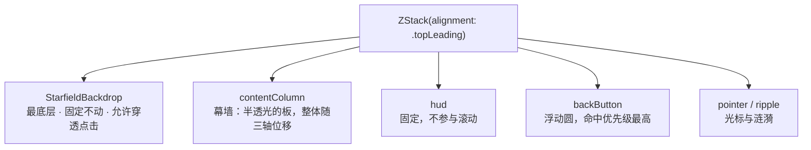
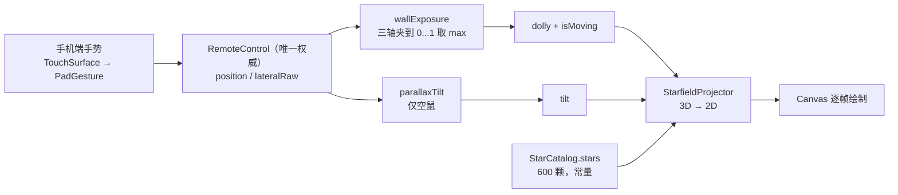

# 照片星星海：假 3D 星空穹顶

外接屏相册幕墙背后的那片星空。它由 `Sources/ExternalDisplay/` 下**两个文件、591 行**构成：

| 文件 | 行 | 职责 | 依赖 |
| --- | --- | --- | --- |
| `StarfieldModel.swift` | 266 | 星表生成 + 3D→2D 投影 + 闪烁计算。**全是纯函数** | `CoreGraphics` / `Foundation`，外加同层的 `SeededGenerator` |
| `StarfieldBackdrop.swift` | 325 | SwiftUI 渲染：穹顶底色、暗点分桶、亮星、光芒 | SwiftUI |

第二个文件只做"把第一个文件算出来的东西画出来"。**所有能算错的量都在纯函数里** ——
投影、深度衰减、亮度分布、闪烁相位全在 `StarfieldModel`，因此可以脱离视图、
脱离模拟器跑断言（见第七节）。

本文档是星海的**单一来源**。既有文档里的相关段落散落在
[`README.md` 第九节](../README.md)、
[`devnotes/2026-09-24-waterfall-starfield.md`](devnotes/2026-09-24-waterfall-starfield.md)、
[`specs/glass-wall-gesture.md`](specs/glass-wall-gesture.md)，
那几处的星海部分读本文即可。

---

## 一、它在层次里的位置

`ExternalDisplayRootView` 用 `ZStack` 叠五层，星海是**最底层**：



出处：`ExternalDisplayRootView.swift:108-125`，层次说明在 `:24-30`。

**关键设计：星海自己不动。** 它永远铺满整个视口、位置恒定；
"看到多少星海"完全由上层那块板被推开多少、以及板的透明度决定。
因此不存在两套动画互相对相位的问题 —— 板与星海之间没有任何共享时钟。

```swift
StarfieldBackdrop(
    dolly: exposure,
    tilt: parallaxTilt,
    isMoving: exposure > 0,
    isAnimated: store.isAnimated
)
```

出处：`ExternalDisplayRootView.swift:109-114`。

---

## 二、它是被什么驱动的

星海只有**四个**输入，没有别的。

| 参数 | 类型 | 含义 | 来源 |
| --- | --- | --- | --- |
| `dolly` | `CGFloat` | 相机推进量 `0...1`，0 = 最远 | `wallExposure(pull:bottomPull:lateral:)`，`ExternalDisplayRootView.swift:239-241` |
| `tilt` | `CGPoint` | 视差倾斜，各轴归一化 `-1...1` | `parallaxTilt`，`:460-463` |
| `isMoving` | `Bool` | 是否跑帧 | `exposure > 0` |
| `isAnimated` | `Bool` | 总开关，来自手机端「帧驱动动画」 | `DisplayContentStore.isAnimated`（`DisplayContentStore.swift:37`，UI 在 `PhoneRootView.swift:87`） |



### 2.1 `dolly` 为什么取三条轴的最大值

```swift
func wallExposure(pull: CGFloat, bottomPull: CGFloat, lateral: CGFloat) -> CGFloat {
    let top = min(max(pull, 0), 1)
    let bottom = min(max(bottomPull, 0), 1)
    let horizontal = abs(min(max(lateral, -1), 1))
    return max(top, max(bottom, horizontal))
}
```

出处：`DisplayScrollGeometry.swift:116-121`。

三条轴的取值范围与符号各不相同（`pull` / `bottomPull` 是 `0...1`，`lateral` 是 `-1...1`），
但"这块板被推开了多少"是**同一个量** —— 横推让出的左侧与下拉让出的上半屏，
是同一块板浮起来的两面，投影强度与相机推进不该有两种算法。

夹一次而不是对 `lateral` 取绝对值最大值：负的 `lateral` 表示往另一个方向推，
"推开了多少"仍然是非负量。

### 2.2 `tilt` 只由空鼠驱动

```swift
private var parallaxTilt: CGPoint {
    guard remote.pointerSource == .airMouse, let pointer = remote.pointer else { return .zero }
    return CGPoint(x: (pointer.x - 0.5) * 2, y: (pointer.y - 0.5) * 2)
}
```

出处：`ExternalDisplayRootView.swift:460-463`。

空鼠的物理动作就是"抬手转动手机"，那正是视差的来源。
触控板上的手指位置和"视角"没有任何物理关系 —— 拿它做视差会让星海在滚动时跟着乱晃。

好处是零成本：光标本来就在传，不需要为视差再开一路传感器。

---

## 三、投影：为什么是"压缩过的透视"

### 3.1 教科书式透视除法不能用

`scale = focal / depth` 会把深度差放大成巨大的尺度差。
本例里 `depth` 从 `0.34` 到 `1.14`，`scale` 就从 `2.65` 跨到 `0.79` ——
近处的星被推出画面、远处的星全挤在中心，**整片星海变成一个隧道，而不是穹顶**。

但完全不做透视（纯分层平移）又只剩平移视差，近处的不变大、远处的不变淡，
大脑立刻判定这是张平面图。

### 3.2 位置与尺寸分别压缩

```swift
let rawScale = focal / depth                  // focal = 0.9
let positionScale = pow(rawScale, 0.35)       // 位置位移
let sizeScale     = pow(rawScale, 0.60)       // 尺寸
```

出处：`StarfieldModel.swift:133-135`，两个指数定义在 `:112` 与 `:115`。

尺寸的指数比位置大：**"远小近大"是大脑判断深度最强的单一线索**，
所以它值得比位置更大的动态范围。两者共用同一个 `rawScale`，
因此仍然严格单调、物理自洽，只是把动态范围收窄到「穹顶」的量级。

### 3.3 实测系数范围

代码注释里写的是近似区间。实测（扫遍星表可达的 `z ∈ 0.6...1.4` × `dolly ∈ 0...1`）：

| 系数 | 注释所写 | **实测** | 极值出现在 |
| --- | --- | --- | --- |
| `positionScale` | 0.82...1.35 | **0.857...1.406** | 最远静止 / 最近满推 |
| `sizeScale` | 0.76...1.79 | **0.767...1.793** | 同上 |

注释在**满推那一端偏窄了**（`dolly = 1` 时最近的一批星会到 1.406）。
观感上无影响，但若要按系数做别的计算，以实测值为准。

### 3.4 其余投影常量

| 常量 | 值 | 出处 | 为什么 |
| --- | --- | --- | --- |
| `focal` | `0.9` | `:94` | `depth == focal` 时基准透视系数为 1 |
| `fill` | `0.94` | `:103` | 略小于 1，让最外圈有一点星被裁出画面；严丝合缝会形成一条肉眼可见的"星星截止线" |
| `dollyDepth` | `0.26` | `:106` | 相机推进把深度压掉多少，见下 |
| `tiltGain` | `0.10` | `:109` | 视差最大横移量，占分布半径的比例 |
| `centerYRatio` | `0.44` | `:118` | 视点略高于几何中心 —— 从下方仰视穹顶比正中平视更像星空顶 |
| 分布半径 | `半宽 / 半高` | `:96-99` | 用 `min(w, h)` 会让横屏宽幅的左右两侧空掉一大片 |

**`dollyDepth` 只取 0.26 是刻意的。** 劳斯莱斯的星空顶是"一片静止的穹顶 + 极缓慢的
视角变化"，不是穿梭飞行。推太深会变成星际穿越，那种急速拉丝的观感和"星空顶"是两回事。

### 3.5 两处容易被误读的边界

**(1) 剔除逻辑在当前参数下永不触发。**
`project` 里有一段 `guard depth > 0.12 else { return nil }`（`:131`），
注释说"相机已经穿过它（或贴到眼前）：剔除"。

但星表的 `z` 下限是 `0.6`、`dolly` 上限是 `1`，所以最小 `depth = 0.6 - 0.26 = 0.34`，
**是 0.12 阈值的约 2.8 倍 —— 实测 600 颗在 `dolly = 1` 时全部可投影，一颗都没被剔除。**
这段是防御性护栏（防 `dolly` 或 `z` 将来被改到超限后除以近零、得到一颗占满整屏的白色巨物），
不是当前生效的路径。断言里的剔除用例因此是**构造**出来的（`z = 0.2` + `dolly = 1`）。

**(2) 感知提亮不是"调好看"。**
亮度、深度衰减、闪烁三个系数相乘之后中位数会掉到 0.5 附近，
在近黑底上那就是一片灰点，不像星星。所以最后过一次 `pow(v, 0.72)`（`:166-169`）把中间调抬起来，
暗端仍是 0。亮底暗前景与暗底亮前景本来就需要不同的 gamma，线性叠加出来的中间调在感知上偏暗。

---

## 四、星表：一次生成，永不改变

### 4.1 固定种子

```swift
static func makeStars(count: Int = defaultCount, seed: UInt64 = 20_260_924) -> [Star]
```

出处：`StarfieldModel.swift:204`。随机源是 `SeededGenerator`（SplitMix64，
定义在 `WaterfallLayout.swift:260`）—— 瀑布流卡片高度与星点共用同一个确定性序列。

固定种子不是为了"好看"，是**验证前提**：逐状态截图对比是本项目唯一可行的自动化手段，
而 `SystemRandomNumberGenerator` 每次进程启动都不一样，会让两次截图无法对比。

### 4.2 一颗星的全部参数

`Star` 是**静态**结构体，全部与时间无关（`StarfieldModel.swift:8-36`）——
闪烁靠相位与角频率现算，不存状态。所以星表只生成一次，每帧只做投影与绘制。

| 字段 | 生成式 | 区间 |
| --- | --- | --- |
| `x` / `y` | 均匀 | `-1...1` |
| `z` | `0.6 + U × 0.8` | `0.6...1.4`（0.6 最近） |
| `brightness` | `0.50 + pow(U, 1.7) × 0.50` | `0.50...1.00`，**幂律** |
| `baseRadius` | `0.55 + brightnessRoll × 1.25 + pow(U, 2.0) × 1.05` | 实测 `0.56...2.65` pt |
| `twinklePhase` | `U × 2π` | `0...2π` |
| `twinkleSpeed` | `0.5 + U × 1.6` | 实测 `0.50...2.10` rad/s |
| `warmth` | `pow(U, 3)` | `0...1`，三次幂 |
| `role` | `brightness > 0.90 ? .bright : .speck` | — |

### 4.3 实测分布（600 颗，种子 20260924）

| 量 | 实测 | 断言要求 |
| --- | --- | --- |
| 亮星（走光晕路径） | **72 / 600 = 12.0%** | `5%...20%` |
| 带十字光芒 | **17 / 600 = 2.8%** | `0.4%...8%` |
| 亮度中位数 | **0.651** | `0.58...0.78` |
| 投影后不透明度中位数（1080p） | **0.600**（静止）/ **0.652**（满推） | `> 0.55` |
| 暖度均值 | **0.253** | `0.20...0.30`（理论 0.25） |
| 明显偏暖（`warmth > 0.8`） | **38 颗** | `< 15%` |
| 闪烁系数极差（同一时刻） | **0.180**（`0.820...1.000`） | `> 0.15` |

### 4.4 六条"像不像"的决定因素

随机白点不等于星空顶：

（下表行号均指 `StarfieldModel.swift`，跨文件处已显式写出文件名。）

| # | 要素 | 实现 | 为什么 |
| --- | --- | --- | --- |
| 1 | **穹顶底色** | 中心偏上稍亮的深蓝 → 边缘全黑，`drawDome` (`StarfieldBackdrop.swift:127-141`) | 纯黑背景会让星点看起来贴在玻璃上。亮区中心在 `0.40` 高度，落在星点最密处、避开下半屏内容 |
| 2 | **亮度幂律** | 指数 `1.7` (`:217`) | 均匀随机会让整片"一样亮"，那是噪点不是星空。但指数不能太陡 —— 中位数掉到三四成再乘深度衰减与闪烁，多数星只剩两成不透明度，"星星海"会退化成"几颗孤星" |
| 3 | **独立闪烁** | 每颗星自己的相位与频率 (`:235-236`) | **同步呼吸是"假"的第一来源**，真实星空不会整片一起眨眼 |
| 4 | **十字光芒** | 最亮约 3% 才有。一条闭合路径 + 一次径向渐变 (`StarfieldBackdrop.swift:197-238`) | 不是四条各带线性渐变的描边 —— 后者要 4 次绘制，且接缝处有亮度断层 |
| 5 | **尺寸与亮度正相关** | `baseRadius` 与 `brightnessRoll` 挂同一路随机 (`:226`) | 挡掉"半径 4pt 却只有三成不透明度"那种像污渍的组合 |
| 6 | **深度衰减** | `1 - normalized × 0.40`，下限 `0.60` (`:177-180`) | 没有它纵深立刻塌掉。但下限不能更低 —— 再暗下去远处的星整片消失，星海会比实际稀疏 |

**闪烁幅度也有限制**：`twinkle` 落在 `0.82...1`，不是 `0...1`（`:261-265`）。
闪到全灭会让星海看起来在抖而不是在闪，而且闪烁是乘在已偏暗亮度上的第三个衰减系数，
幅度大了整片会一起变灰。

---

## 五、绘制：三条路径与帧预算

（本节行号均指 `StarfieldBackdrop.swift`。）

| 路径 | 对象 | 每帧成本 | 出处 |
| --- | --- | --- | --- |
| 穹顶底色 | 1 次径向渐变铺满 | 1 次填充 | `:127-141` |
| **暗点分桶** | 约 88% 的星 | **最多 60 次合并填充** | `:269-309` |
| 亮星光晕 | 72 颗，本体 2.4 倍大的渐变 | 72 次 | `:156-173` |
| 亮星本体 | 72 颗实心圆 | 72 次 | `:176-184` |
| 十字光芒 | ≤ 17 颗，且投影半径 > 1.2pt | ≤ 17 次 | `:188-189` |

**合计约 221 次绘制调用/帧**（实测统计），与"600 颗逐颗画"的 600+ 次相比是三分之一的量。

### 5.1 暗点分桶是这个视图唯一真正影响帧预算的优化

600 颗星里九成以上是暗点，逐颗 `fill` 就是每帧 550 次绘制调用 ——
而它们全是同一种东西：一个 1pt 左右的小圆。

`SpeckBuckets` 按 `5 尺寸档 × 6 不透明度档 × 2 色温档 = 60 个桶`
把椭圆累加进各自的 `Path`，循环结束后统一填充，于是每帧只剩几十次调用
（`StarfieldBackdrop.swift:269-309`）。

两个反直觉的细节：

1. **曾经用方块代替圆，理由是"等价于点且更便宜"—— 实测不成立。**
   1.5pt 的方块在 3x 屏上是 4~5 个物理像素，放大后能明确看出是方的，
   整片星海看起来像像素噪点。合并 Path 之后画圆的代价已可忽略。
2. **桶内取最大的那个不透明度**，而不是平均或最小（`:297`）——
   宁可整桶略亮，也不要让最暗的一颗把整桶拖灰。

### 5.2 亮星为什么可以逐颗画

只有 72 颗，逐颗画无所谓。真正的护栏是**比例受控**：
亮星每颗要画一层径向渐变光晕，72 颗对应每帧约 10 万像素的渐变填充，
相对 4K 的 830 万像素可以忽略；代码注释记录"把阈值降到 0.85（占比翻倍）
就开始看得见掉帧"——**这一条来自开发期观察，本机没有真 4K 外接屏复测过**。

这条因此被固化成断言（`brightRatio` 必须在 `5%...20%`），
而不是留在注释里当经验。

### 5.3 视口外剔除

投影后的点若不落在视口外扩 `min(w, h) × 0.08` 的范围里就跳过
（`StarfieldBackdrop.swift:88, 96-98`）—— 相机推进时近处的星会被推到画面外很远，
不剔除会白白构造一堆屏幕外的形状。

实测：1080p 视口下，静止时 599/600 落在带内，满推时 574/600。

### 5.4 太暗的不画

`guard opacity > 0.02 else { continue }`（`:101`）。
深度衰减 + 幂律分布 + 闪烁三重乘下来，总有一批星落到看不见的程度，
继续构造形状只是白花帧预算。

---

## 六、帧驱动与停帧判据

```swift
TimelineView(.animation(minimumInterval: 1.0 / 60.0, paused: !isActive)) { timeline in
    Canvas { context, size in draw(...) }
}
```

出处：`StarfieldBackdrop.swift:58-68`。`isActive = isMoving && isAnimated`（`:51`）。

与 `DisplayPatternCanvas` 同一套基建。手机端关掉「帧驱动动画」后外接屏应当立刻静止，
这一点同样适用于星海 —— 这就是 `isAnimated` 存在的意义：它是"证明帧驱动确实来自本应用"的开关。

### 6.1 停帧判据是"动没动"，不是"露出来没"

| | 判据 | 静止时的画面上有星海吗 |
| --- | --- | --- |
| 旧 | `pull > 0.002` | **没有**（透明度 0，等于没画） |
| 现 | `exposure > 0`（三条轴任一非零） | **有**（保留最后一帧，缝里照旧看得到） |

改动的原因是幕墙材质变了：早先容器背景不透明，星海是"下拉才出现"的反转效果；
幕墙改成半透光的板之后这条前提没了 —— **星海常驻可见**，
列间距那条缝里看到的就是它。若还按 `pull` 淡入，静止时缝里会是纯黑。

今天 `StarfieldBackdrop` 上刻意**没有** `.opacity(...)`，透明度恒为 1（`:70-71`）。

### 6.2 三条代价，都是明确接受过的

1. **静止时星星不闪。** 要让它一直闪就把 `isMoving` 传 `true`，
   但那等于让一块静止的屏永久占用 600 颗星的绘制预算 —— 4K 上不是小数，
   而外接屏没有虚拟化，这笔钱是按"永远"付的。
2. **顶部下拉的观感变了。** 今天"下拉才露出星海"不再是一个强反转信号，
   下拉变成纯粹"把板推下去"。这是需求方确认过的取舍。
3. **`.allowsHitTesting(false)`**（`:72`）—— 星海不吃任何事件。
   外接屏本来就收不到触摸，这条是防它在将来被叠到可交互层之上时挡住命中。

---

## 七、验证

### 7.1 纯函数断言

`StarfieldModel` 只依赖 `CoreGraphics` + `Foundation`（外加同一纯层里的 `SeededGenerator`），
可以脱离视图独立编译 —— 所以下面的编译命令里带上了 `WaterfallLayout.swift`。
星海专属断言 **34 条**，分布如下：

| 节 | 条数 | 覆盖 |
| --- | --- | --- |
| §5 星海投影 | 6 | 近大远小 / 近亮远暗 / 相机推进后平均半径增大 / 剔除 / 视差方向 / 水平倾斜不影响纵坐标 |
| §6 星表分布 | 16 | 同种子同星海 / 亮度中位数 / 投影后不透明度中位数 / 亮星占比 / 光芒占比 / 暖度均值 / 深度与坐标范围 / 闪烁区间与差异 |
| §7 铺满度 | 9 | 三种视口各 3 条：可见比例、横向铺满、纵向铺满 |
| §8 露出区域星数 | 3 | 三种视口各 1 条 |

另有 §10 的 **10 条曝光量断言**（`wallExposure` 的夹取、取最大、负值处理、
停帧判据"三轴全零才停"）—— 那是星海的**驱动前提**，也在这套脚本里。

脚本当前总数 **366 条全过**。运行方式：

```sh
cd /path/to/ExternaldisplayDemo
xcrun swiftc -O Sources/ExternalDisplay/WaterfallLayout.swift \
      Sources/ExternalDisplay/WaterfallFocus.swift \
      Sources/ExternalDisplay/PhotoDetailGeometry.swift \
      Sources/ExternalDisplay/DisplayScrollGeometry.swift \
      Sources/ExternalDisplay/LateralGeometry.swift \
      Sources/ExternalDisplay/BackButtonGeometry.swift \
      Sources/ExternalDisplay/StarfieldModel.swift \
      Sources/Core/PadGesture.swift \
      Sources/Core/TapSequence.swift \
      .scratch/verify/main.swift -o .scratch/verify/verify && .scratch/verify/verify
```

脚本在 `.scratch/verify/`（已 gitignore）。

### 7.2 密度实测

| 视口 | 可见 | 横向跨度 | 纵向跨度 |
| --- | --- | --- | --- |
| 1080p（1920×1080 点） | 599/600 (100%) | 1979 / 1920 | 1123 / 1080 |
| 4:3（1024×768 点） | 599/600 (100%) | 1056 / 1024 | 798 / 768 |
| 模拟器 letterbox（355×200 点） | 599/600 (100%) | 366 / 355 | 208 / 200 |

**跨度必须 ≥ 视口尺寸**，否则四周会出现一圈没星的空白 —— 那圈空白比星星本身更显眼。

下拉到 1 时只露出上半屏，那半屏的实际星数单独量：三种视口都是 **319 颗（53%）**。

### 7.3 复现本文的实测数字

`.scratch/tools/starfield-probe/main.swift`（已 gitignore）扫遍投影系数可达范围并统计星表：

```sh
xcrun swiftc -O Sources/ExternalDisplay/WaterfallLayout.swift \
      Sources/ExternalDisplay/StarfieldModel.swift \
      .scratch/tools/starfield-probe/main.swift -o .scratch/tools/starfield-probe/probe \
  && .scratch/tools/starfield-probe/probe
```

（`swiftc` 多文件编译时，顶层语句只能写在名为 `main.swift` 的文件里。）

### 7.4 渲染侧的验证手段

「状态 → 渲染」这半条可以脚本化：用 `-remoteState` 预置状态后逐状态截图。

```sh
xcrun simctl launch <device> <bundle> -mockExternalDisplay -remoteState bottom=1
xcrun simctl launch <device> <bundle> -mockExternalDisplay -remoteState lateral=-1
xcrun simctl launch <device> <bundle> -mockExternalDisplay -remoteState pull=1
```

完整流程（含 `--terminate-running-process` 不能省、`sleep 3` 为什么必要、
以及像素探针 `TOL=1` 的陷阱）见
[`external-display-screenshot.md`](external-display-screenshot.md)。

**一处必须知道的限制**：星海走 `TimelineView(.animation)`，首帧要等 `CADisplayLink` 起来，
截图太早会拍到还没点亮的星海 —— 所以那个文档里的 `sleep 3` 不是保守，是必要。

---

## 八、已知限制与盲区

| 项 | 状态 |
| --- | --- |
| 真机 + 真外接屏的观感 | ❌ **从未实测**（没有 HDMI 适配器）。模拟器只能确认渲染逻辑，不能确认外接屏上的实际观感与帧率 |
| 4K 外接屏的实际帧率 | ❌ 未实测。帧预算只有静态统计（221 次绘制调用），没有真机 `CADisplayLink` 掉帧数据 |
| 真实外接屏的色深 / 色彩表现 | ❌ 未验证。替身窗口的 `scale` 是硬编码 3（`MockExternalDisplay.swift:42`） |
| 手机端拖拽产生状态 | ❌ 只能手点 —— `simctl` 没有触摸注入 API。见 `external-display-screenshot.md` 第七节的能/不能表 |
| 星海与幕墙的相位关系 | ✅ 结构上不存在（星海不动，只看被让出多少） |
| 投影 / 分布 / 密度 | ✅ 34 条断言 + 三视口实测 |

---

## 九、要把它搬到别的项目

| 带走什么 | 文件 | 说明 |
| --- | --- | --- |
| 必须 | `StarfieldModel.swift` | 星表 + 投影，纯计算；唯一外部依赖是 `SeededGenerator` |
| 必须 | `StarfieldBackdrop.swift` | 渲染。**唯一要改的是 `dolly` / `tilt` / `isMoving` 的接法** |
| 顺带 | `WaterfallLayout.swift` 里的 `SeededGenerator` | 确定性随机源。不需要确定性就换回系统随机 |
| 可选 | `DisplayScrollGeometry.swift` 里的 `wallExposure` | 单轴场景直接用 `dolly` 即可 |

星海这两个文件对项目其他部分的依赖**只有一处**：`StarfieldModel` 用 `SeededGenerator`
做确定性随机（实测：除此之外无任何跨文件引用；对上层符号的匹配全部落在注释里）。

最小接入是四行：给一个 `dolly`、一个 `tilt`、一个 `isMoving`，再加一个 `isAnimated` 开关。

完整的可移植性清单（包 A/B/C 划分、24 个文件的依赖扫描结论、5 处必改项）见
[`portable-effects.md`](portable-effects.md)。
